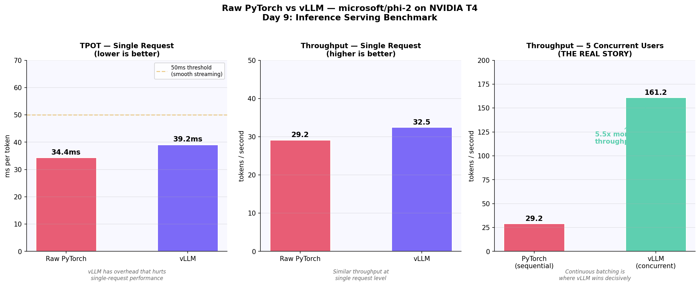

## Day 9 — Inference Serving Benchmark

**Raw PyTorch vs vLLM on microsoft/phi-2 (2.7B)**  
Hardware: NVIDIA T4 16GB | Framework: vLLM vs raw PyTorch

---

## Results

| Metric | Raw PyTorch | vLLM | Winner |
|--------|-------------|------|--------|
| TPOT (single request) | 34.4ms | 39.2ms | PyTorch |
| Throughput (single) | 29.2 tok/s | 32.5 tok/s | vLLM |
| Throughput (5 concurrent) | 29.2 tok/s | 161.2 tok/s | vLLM 5.5x |
| Cold start TTFT | 1,604ms | — | Avoid with warm instances |
| Warm TTFT | ~39ms | — | Well under 200ms threshold |

---

## Key Findings

**Finding 1 — vLLM loses on single requests**  
vLLM's PagedAttention, async scheduler, and chunked prefill 
add overhead with no payoff at single-user scale. Raw PyTorch 
wins by ~5ms TPOT when only one user is active.

**Finding 2 — vLLM wins decisively at scale (THE key finding)**  
At 5 concurrent users, vLLM delivers 161 tok/s vs PyTorch's 
29 tok/s sequential throughput — a 5.5x advantage. Continuous 
batching is the reason. At 100+ concurrent users the gap 
becomes the difference between profitable and unprofitable 
unit economics.

**Finding 3 — Cold start is a real production problem**  
First request TTFT: 1,604ms. Subsequent requests: 33-59ms.  
GPU kernel compilation happens once on first inference call.  
PM rule: never scale inference servers to zero. Always maintain  
at least one warm instance.

**Finding 4 — phi-2 is production-viable on T4**  
Both frameworks pass the latency thresholds:
- TPOT <50ms (smooth streaming): PASS
- Warm TTFT <200ms (real-time chat): PASS

A 70B model on T4 would fail both thresholds significantly.

---

## PM Insight

vLLM is not universally better than raw PyTorch. It is better  
at scale. The business case for vLLM is the concurrent throughput  
advantage — at >50 QPM it reduces GPU cost by 4-5x. Below that  
threshold the overhead is not worth it.

TensorRT-LLM on H100 would add another 2-4x on top of vLLM —  
potentially 10-20x faster than raw PyTorch on T4 combined.  
That is the serving stack progression: raw PyTorch → vLLM → TensorRT-LLM.

---

*Souvik Kundu · AI PM Master Curriculum · Day 9*  
*github.com/souvikkai/souvik-ai-pm-portfolio*

